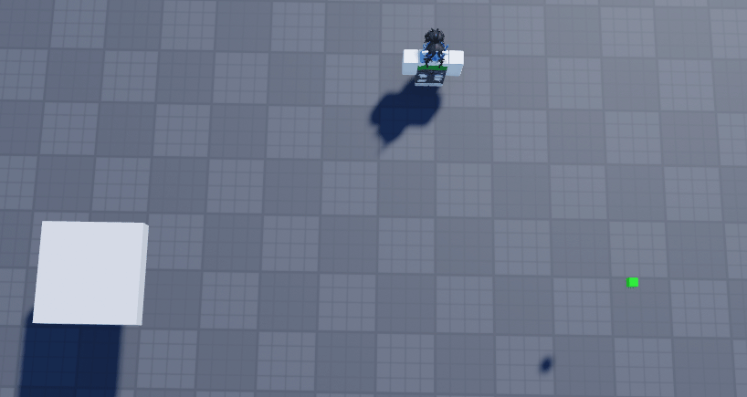

Finally, after years of development, a v1.0.0 release is here and available to everybody. This marks Seam as a stable, feature-rich, and production-ready software for any scale of development.

<!-- truncate -->

# Style Sheets
Huge shoutout to @zapuee on Discord, who contributed this feature!

Style sheets allow you to declare themes and groups for reusable properties across a variety of instances for consistent visuals and behavior. This is particularly helpful for UI, which benefits from stylistic consistency.

Example:

```lua
-- Create a stylesheet object that can store multiple selector rules.
local Theme = Seam.StyleSheet.new()

-- Match every Frame in the tree and apply shared base styling.
Theme:Style("Frame")({
	BackgroundColor3 = Color3.fromRGB(30, 30, 30), -- Dark background for all frames.
	BorderSizePixel = 0, -- Remove the default border.
})

-- Match a specific instance name and override just that target.
Theme:Style("@Title")({
	TextColor3 = Color3.fromRGB(255, 255, 255), -- Make the title readable on the dark theme.
})

-- Apply the stylesheet during construction.
local ScreenGui = New("ScreenGui", {
	Parent = PlayerGui,
	[Seam.StyleSheet] = Theme,
})
```

# Bezier States
Bezier computes a quadratic curve from the four driving values. Alpha controls how far the state is along the curve, Origin is the start, Midpoint is the control point, and Target is the end.

This is particuarly great for visual effects and any movement with curves! Take a look at the below gif to see this in action (code is in examples):



# Batching
I added `Seam.Batch`, a utility function that allows you to group state changes into a transaction window, only firing dependency changes once. For example:

```lua
Seam.Batch(function()
	MyValue1.Value = 10
	MyValue2.Value = 20
end)
```

# Resources
Also new to v1.0.0 is `Seam.Resource`, a reactive state for async-loaded values with explicit load status. Use `Resource` when the value depends on an async workflow such as fetching data or waiting on another task.

Example:

```lua
local ProfileResource = Resource(function()
	local data = ReplicatedStorage.GetSecret:InvokeServer()
end)

print(ProfileResource.Status) -- "Loading" at first

OnChanged(ProfileResource, function()
	print(ProfileResource.Value) -- Prints the new
end)

task.delay(5, function()
    ProfileResource:Refresh() -- Update the state with the new secret
end)
```

# Other Changes
Alongside everything here comes performance improvements, bug fixes, and more:
* Added `Rendered.Changed` behind the scenes, allowing `Rendered` instances to be use reactively (such as for computation or animation)
* Added `Value:TableSet()`, `Value:TableRemove()`, and `Value:TableInsert()` for mutability on table values, allowing for reactivity on table edits
* Added sleep/wake behavior to `Tween` and `Spring` (and now also `Bezier`) for improved performance
* State manager now prefers changed signal for updates when possible behind the scenes, improving performance
* Fixed bug with `Tween` caused by changing target mid-animation
* Fixed various potential memory leaks

# Upgrade Today
Seriously, there is a lot you will be missing if you don't update Seam to the newest version!

As a personal note, I'm so happy to finally get Seam to a full release. Developing this library over the years has helped me learn a lot and has ended up being a resource that I use a ton in my own worflow. If you have not tried it yet, I highly recommend doing so.

Thanks to all of the contributors who have helped Seam cross the finish line! This isn't the end, and more awesome updates will continue to release over time.