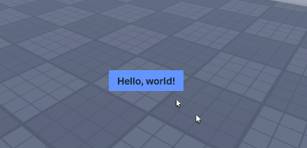

# Expressive button
Who doesn't want a bouncy button? Below is an example script that makes a gui with a button, and makes that button bouncy.

Keep in mind that this script is lengthy because we are making the gui and button via code, but you can also just input existing UI you already designed!



```lua
local ReplicatedFirst = game:GetService("ReplicatedFirst")
local UserInputService = game:GetService("UserInputService")
local PlayersService = game:GetService("Players")

local Seam = require(Path.To.Seam)
local Spring = Seam.Spring
local New = Seam.New
local Children = Seam.Children
local Value = Seam.Value
local Computed = Seam.Computed
local OnEvent = Seam.OnEvent

local Player = PlayersService.LocalPlayer
local PlayerGui = Player:WaitForChild("PlayerGui")

local Gui = New("ScreenGui", {
	ResetOnSpawn = false,
	IgnoreGuiInset = true,
	Parent = PlayerGui,
})

-- We store the state of the button in a Seam value
local State = Value("Idle")

-- Making the springs for size and rotation
local SizeSpring = Spring(Computed(function(Use)
	local CurrentState = Use(State) -- Can be either "Idle", "Hover", or "Press"

	if CurrentState == "Idle" then
		-- Default size
		return UDim2.new(0.1, 0, 0.05, 0)
	elseif CurrentState == "Hover" then
		-- Size when hovering
		return UDim2.new(0.1, 15, 0.05, 15)
	elseif CurrentState == "Press" then
		-- Size when holding mouse or pressing
		return UDim2.new(0.1, -10, 0.05, -10)
	end
end), 18, 0.4)

local RotationSpring = Spring(Computed(function(Use)
	local CurrentState = Use(State) -- Can be either "Idle", "Hover", or "Press"

	if CurrentState == "Idle" then
		-- Default rotation
		return 0
	elseif CurrentState == "Hover" then
		-- Rotation when hovering
		return 0
	elseif CurrentState == "Press" then
		-- Rotation when holding mouse or pressing
		return 3
	end
end), 10, 0.3)

-- We make the button programatically here, but you can
-- also use an existing button you designed if you want!
local ExampleButton = New("TextButton", {
	Text = "Hello, world!",
	BackgroundColor3 = Color3.fromRGB(100, 150, 255),
	BorderSizePixel = 0,
	AnchorPoint = Vector2.new(0.5, 0.5),
	Position = UDim2.fromScale(0.5, 0.8),
	TextScaled = true,
	Font = Enum.Font.BuilderSansBold,
	AutoButtonColor = false,
	Parent = Gui, -- A screen gui in player gui that we made beforehand
	
	-- Making a bouncy size
	Size = SizeSpring,
	
	-- Making a bouncy rotation
	Rotation = RotationSpring,
	
	-- Connect our four events to change the state
	[OnEvent "MouseEnter"] = function()
		State.Value = "Hover"
	end,
	
	[OnEvent "MouseLeave"] = function()
		State.Value = "Idle"
	end,
	
	[OnEvent "MouseButton1Down"] = function()
		State.Value = "Press"
	end,
	
	[OnEvent "MouseButton1Up"] = function()
		State.Value = "Idle"
		SizeSpring.Value += UDim2.fromOffset(50, 50) -- Impulse size spring, giving it a pop
		RotationSpring.Value = math.random(-10, 10) -- And same for rotation spring
	end,
	
	[Children] = {
		-- Add a UI padding,
		New("UIPadding", {
			PaddingTop = UDim.new(0.1, 0),
			PaddingLeft = UDim.new(0.1, 0),
			PaddingBottom = UDim.new(0.1, 0),
			PaddingRight = UDim.new(0.1, 0),
		}),
		
		-- and a UI corner
		New("UICorner", {
			CornerRadius = UDim.new(0.1, 0),
		})
	}
})
```