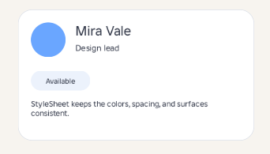

# Profile card
This example shows how to build a clean profile card UI with `StyleSheet`. The styles are attached by tag, so the card stays easy to read and the visual rules stay reusable.

It looks like this:



```lua
local ReplicatedFirst = game:GetService("ReplicatedFirst")
local Players = game:GetService("Players")

local Seam = require(ReplicatedFirst.Seam)
local New = Seam.New
local Tags = Seam.Tags

local Player = Players.LocalPlayer
local PlayerGui = Player:WaitForChild("PlayerGui")

-- Create a reusable theme for the whole interface.
local Theme = Seam.StyleSheet.new()

-- Soft background for the whole screen.
Theme:Style("#Backdrop")({
	BackgroundColor3 = Color3.fromRGB(247, 244, 239),
})

-- Main card surface.
Theme:Style("#Card")({
	BackgroundColor3 = Color3.fromRGB(255, 255, 255),
})

-- Accent circle on the left.
Theme:Style("#Accent")({
	BackgroundColor3 = Color3.fromRGB(106, 166, 255),
})

-- Badge pill.
Theme:Style("#Badge")({
	BackgroundColor3 = Color3.fromRGB(236, 242, 252),
})

-- Call-to-action button.
Theme:Style("#PrimaryButton")({
	BackgroundColor3 = Color3.fromRGB(43, 49, 66),
	TextColor3 = Color3.fromRGB(255, 255, 255),
})

-- Shared typography for the whole card.
Theme:Style("TextLabel")({
	BackgroundTransparency = 1,
	Font = Enum.Font.BuilderSans,
	TextColor3 = Color3.fromRGB(43, 49, 66),
})

local ScreenGui = New("ScreenGui", {
	ResetOnSpawn = false,
	IgnoreGuiInset = true,
	Parent = PlayerGui,

	-- Apply the stylesheet while the UI is being created.
	[Seam.StyleSheet] = Theme,
})

local Backdrop = New("Frame", {
	Parent = ScreenGui,
	Size = UDim2.fromScale(1, 1),
	[Tags] = {"Backdrop"},
})

local Card = New("Frame", {
	Parent = ScreenGui,
	AnchorPoint = Vector2.new(0.5, 0.5),
	Position = UDim2.fromScale(0.5, 0.5),
	Size = UDim2.fromOffset(380, 210),
	[Tags] = {"Card"},
})

New("UICorner", {
	Parent = Card,
	CornerRadius = UDim.new(0, 22),
})

New("UIStroke", {
	Parent = Card,
	Color = Color3.fromRGB(224, 228, 236),
	Thickness = 1,
})

local Accent = New("Frame", {
	Parent = Card,
	Position = UDim2.fromOffset(20, 20),
	Size = UDim2.fromOffset(56, 56),
	[Tags] = {"Accent"},
})

New("UICorner", {
	Parent = Accent,
	CornerRadius = UDim.new(1, 0),
})

New("TextLabel", {
	Parent = Card,
	Position = UDim2.fromOffset(92, 18),
	Size = UDim2.fromOffset(220, 30),
	Text = "Mira Vale",
	TextSize = 26,
	TextXAlignment = Enum.TextXAlignment.Left,
})

New("TextLabel", {
	Parent = Card,
	Position = UDim2.fromOffset(92, 50),
	Size = UDim2.fromOffset(220, 22),
	Text = "Design lead",
	TextSize = 16,
	TextXAlignment = Enum.TextXAlignment.Left,
})

local Badge = New("Frame", {
	Parent = Card,
	Position = UDim2.fromOffset(20, 98),
	Size = UDim2.fromOffset(96, 32),
	[Tags] = {"Badge"},
})

New("UICorner", {
	Parent = Badge,
	CornerRadius = UDim.new(1, 0),
})

New("TextLabel", {
	Parent = Badge,
	Size = UDim2.fromScale(1, 1),
	Text = "Available",
	TextSize = 14,
	TextXAlignment = Enum.TextXAlignment.Center,
})

New("TextLabel", {
	Parent = Card,
	Position = UDim2.fromOffset(20, 142),
	Size = UDim2.fromOffset(300, 34),
	Text = "StyleSheet keeps the colors, spacing, and surfaces consistent.",
	TextWrapped = true,
	TextSize = 15,
	TextXAlignment = Enum.TextXAlignment.Left,
})
```