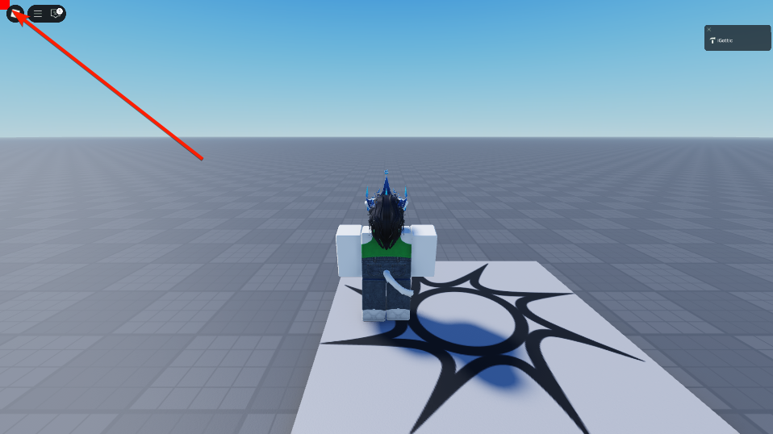
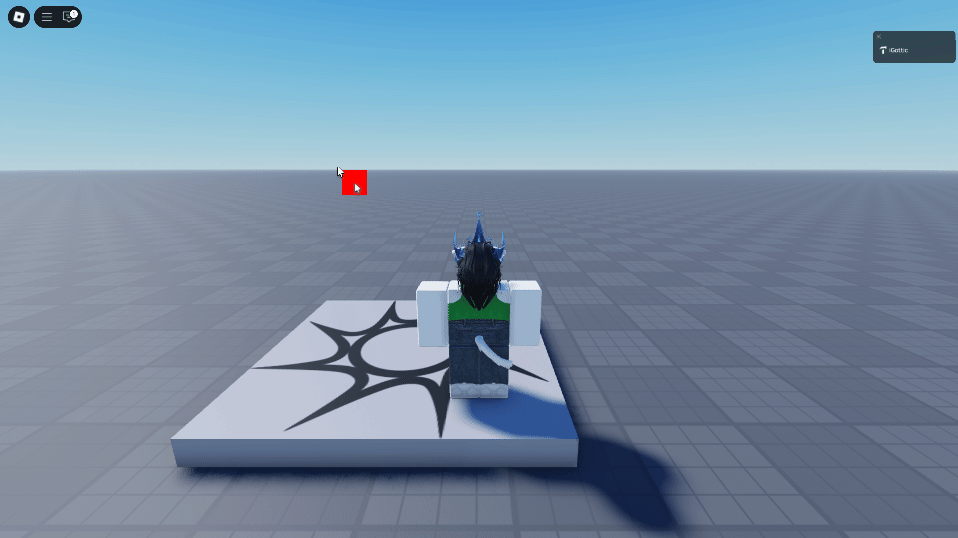

# Learning the basics
Let's get started with Seam! To help you learn this state library and some big important features, we're going to make a square frame that chases your mouse.

Once you finish, you should have something like this:


To begin, let's make a couple of assumptions:
* We're programming this in Studio, not an external editor
* Seam and the example code are both located in `ReplicatedFirst`

Let's start by declaring our services and variables

```lua
local ReplicatedFirst = game:GetService("ReplicatedFirst")
local UserInputService = game:GetService("UserInputService")
local PlayersService = game:GetService("Players")

local Seam = require(ReplicatedFirst.Seam) -- For the sake of this tutorial, this is where Seam is

local Player = PlayersService.LocalPlayer
local PlayerGui = Player:WaitForChild("PlayerGui")
```

In this tutorial, you'll first learn how to use `Rendered`, `Spring`, and `New`. So, let's import them as well!

```lua
local ReplicatedFirst = game:GetService("ReplicatedFirst")
local UserInputService = game:GetService("UserInputService")
local PlayersService = game:GetService("Players")

local Seam = require(ReplicatedFirst.Seam)
local Rendered = Seam.Rendered -- We will use this
local Spring = Seam.Spring -- And this
local New = Seam.New -- And this

local Player = PlayersService.LocalPlayer
local PlayerGui = Player:WaitForChild("PlayerGui")
```

Now, before we get to making the chasing square, we need a *ScreenGui* instance under the player's *PlayerGui* that we can put it in. We can use Seam's `New`, which acts as if `Instance.new()` had a bunch of extra Seam spice.

You can make a new instance using the format `New(ClassName, Properties)`. In this case, we want a GUI that:
* Does not reset when you die
* Ignores gui inset
* And of course, is parented to *PlayerGui*

So let's put this at the end of our script:

```lua
local Gui = New("ScreenGui", {
	ResetOnSpawn = false,
	IgnoreGuiInset = true,
	Parent = PlayerGui,
})
```

So far, it's the equivalent to doing this:

```lua
local Gui = Instance.new("ScreenGui")
Gui.ResetOnSpawn = false
Gui.IgnoreGuiInset = true
Gui.Parent = PlayerGui
```

Moving on though, let's get to the meat of this: the chasing square!

Let's start by (at the end of script) making our frame object:

```lua
local ChasingSquare = New("Frame", {
	Size = UDim2.fromOffset(50, 50),
	BackgroundColor3 = Color3.fromRGB(255, 0, 0),
	BorderSizePixel = 0,
	AnchorPoint = Vector2.new(0.5, 0.5),
	Parent = Gui,
})
```

This frame is 50x50 square size, is red, has no border, anchored in the middle, and is parented to `Gui`.

If you press play right now, you should see it sitting in the top-left corner:



Let's start by making the square lock to where the mouse is. In this case, we'll be using `Rendered`, which returns any value every frame, and that value can be used elsewhere. This means that you can even use this state as a value to an instance property.

We can make a `Rendered` instance from Seam that, every frame, returns the mouse position as a *UDim2*, like so:

```lua
-- Let's make the rendered instance
local MousePositionRender = Rendered(function()
	local MouseLocation = UserInputService:GetMouseLocation() -- Get mouse position as Vector2
	local TargetPosition = UDim2.fromOffset(MouseLocation.X, MouseLocation.Y) -- Convert it to UI position

	return TargetPosition -- Return the UI position
end)

local ChasingSquare = New("Frame", {
	Size = UDim2.fromOffset(50, 50),
	BackgroundColor3 = Color3.fromRGB(255, 0, 0),
	BorderSizePixel = 0,
	AnchorPoint = Vector2.new(0.5, 0.5),
	Parent = Gui,

	Position = MousePositionRender -- Let's hook it up here
})
```

The `MousePositionRender` rendered instance is the state, and inside the `New` constructor, we set `Position` to it. The framework handles everything for you, so at this point, you should have a square that locks to your mouse like so:



Now, animating it is super easy; all we have to do is make a `Spring` object, which animates anything as if it were, well, a spring. Below the declaration for the `MousePositionRender` variable, let's make a new `Spring` that takes the render and animates it with a speed of 5 and dampening of 0.5 (these numbers just make it slower, don't worry about their meaning right now):

```lua
local MousePositionRender = Rendered(function()
	local MouseLocation = UserInputService:GetMouseLocation()
	local TargetPosition = UDim2.fromOffset(MouseLocation.X, MouseLocation.Y)

	return TargetPosition
end)

local MousePositionSpring = Spring(MousePositionRender, 5, 0.5) -- Making our spring
```

And then, we just make it so that the frame's position is set to the spring, and not the render. That's it!

```lua
local MousePositionSpring = Spring(MousePositionRender, 5, 0.5)

local ChasingSquare = New("Frame", {
	Size = UDim2.fromOffset(50, 50),
	BackgroundColor3 = Color3.fromRGB(255, 0, 0),
	BorderSizePixel = 0,
	AnchorPoint = Vector2.new(0.5, 0.5),
	Parent = Gui,

	Position = MousePositionSpring -- Changing it from the render to the spring
})
```

And now we have our final result!

```lua
local ReplicatedFirst = game:GetService("ReplicatedFirst")
local UserInputService = game:GetService("UserInputService")
local PlayersService = game:GetService("Players")

local Seam = require(ReplicatedFirst.Seam)
local Rendered = Seam.Rendered
local Spring = Seam.Spring
local New = Seam.New

local Player = PlayersService.LocalPlayer
local PlayerGui = Player:WaitForChild("PlayerGui")

local Gui = New("ScreenGui", {
	ResetOnSpawn = false,
	IgnoreGuiInset = true,
	Parent = PlayerGui,
})

local MousePositionRender = Rendered(function()
	local MouseLocation = UserInputService:GetMouseLocation()
	local TargetPosition = UDim2.fromOffset(MouseLocation.X, MouseLocation.Y)

	return TargetPosition
end)

local MousePositionSpring = Spring(MousePositionRender, 5, 0.5)

local ChasingSquare = New("Frame", {
	Size = UDim2.fromOffset(50, 50),
	BackgroundColor3 = Color3.fromRGB(255, 0, 0),
	BorderSizePixel = 0,
	AnchorPoint = Vector2.new(0.5, 0.5),
	Parent = Gui,

	Position = MousePositionSpring -- Changing it from the render to the spring
})
```


That being said, this is a lot of code for something so simple. So, let's simplify it.

First, we can put the `Rendered` declaration directly inside the spring, like so:

```lua
local MousePositionSpring = Spring(Rendered(function()
	local MouseLocation = UserInputService:GetMouseLocation()
	local TargetPosition = UDim2.fromOffset(MouseLocation.X, MouseLocation.Y)

	return TargetPosition
end), 5, 0.5)
```

But even further, we can set the position property of the frame directly with that. You can delete the variable and move that state directly to the `New` constructor:

```lua
local ChasingSquare = New("Frame", {
	Size = UDim2.fromOffset(50, 50),
	BackgroundColor3 = Color3.fromRGB(255, 0, 0),
	BorderSizePixel = 0,
	AnchorPoint = Vector2.new(0.5, 0.5),
	Parent = Gui,
	
	Position = Spring(Rendered(function()
		local MouseLocation = UserInputService:GetMouseLocation()
		local TargetPosition = UDim2.fromOffset(MouseLocation.X, MouseLocation.Y)

		return TargetPosition
	end), 5, 0.5)
})
```

Near the top of the script, where we delcared our Seam things, let's also import `Children`, which we will use next.

```lua
local Seam = require(ReplicatedFirst.Seam)
local Rendered = Seam.Rendered
local Spring = Seam.Spring
local New = Seam.New
-- We added the below:
local Children = Seam.Children
```

After cleaning up the code to remove unused variables, our script should now look like this:

```lua
local ReplicatedFirst = game:GetService("ReplicatedFirst")
local UserInputService = game:GetService("UserInputService")

local Seam = require(ReplicatedFirst.Seam) -- For the sake of this tutorial, this is where Seam is
local Rendered = Seam.Rendered
local Spring = Seam.Spring
local New = Seam.New

local Gui = New("ScreenGui", {
	ResetOnSpawn = false,
	IgnoreGuiInset = true,
	Parent = PlayerGui,
})

local ChasingSquare = New("Frame", {
	Size = UDim2.fromOffset(50, 50),
	BackgroundColor3 = Color3.fromRGB(255, 0, 0),
	BorderSizePixel = 0,
	AnchorPoint = Vector2.new(0.5, 0.5),
	Parent = Gui,
	
	Position = Spring(Rendered(function()
		local MouseLocation = UserInputService:GetMouseLocation()
		local TargetPosition = UDim2.fromOffset(MouseLocation.X, MouseLocation.Y)

		return TargetPosition
	end), 5, 0.5)
})
```

*But there is more we can do!*

We'll be using the `Children` declaration now. This actually is an index in the `New` constructor, meaning we use it as a property, not a value.

By doing this:

```lua
local Gui = New("ScreenGui", {
	ResetOnSpawn = false,
	IgnoreGuiInset = true,
	Parent = PlayerGui,

	[Children] = {} -- A table of instances
})
```

We are making everything in the table we created be a child of the GUI. Or, in other words, we set the `Parent` property of each of those instances to the GUI.

In this case, we only have a single instance to parent to the GUI: our chasing square frame. Let's do that with `Children`, and the final full script should look like this:

```lua
local ReplicatedFirst = game:GetService("ReplicatedFirst")
local UserInputService = game:GetService("UserInputService")

local Seam = require(ReplicatedFirst.Seam)
local Rendered = Seam.Rendered
local Spring = Seam.Spring
local New = Seam.New
local Children = Seam.Children

local Gui = New("ScreenGui", {
	ResetOnSpawn = false,
	IgnoreGuiInset = true,
	Parent = PlayerGui,

	[Children] = {
		New("Frame", {
			Size = UDim2.fromOffset(50, 50),
			BackgroundColor3 = Color3.fromRGB(255, 0, 0),
			BorderSizePixel = 0,
			AnchorPoint = Vector2.new(0.5, 0.5),

			Position = Spring(Rendered(function()
				local MouseLocation = UserInputService:GetMouseLocation()
				local TargetPosition = UDim2.fromOffset(MouseLocation.X, MouseLocation.Y)

				return TargetPosition
			end), 5, 0.5)
		})
	}
})
```

And that's it! It's a super simple script to do something fun. Now you know the basics!