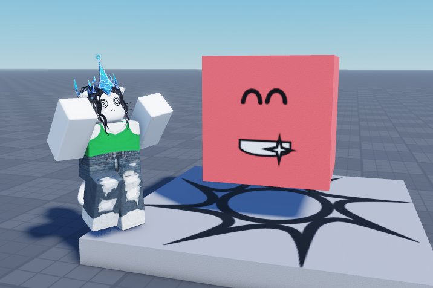
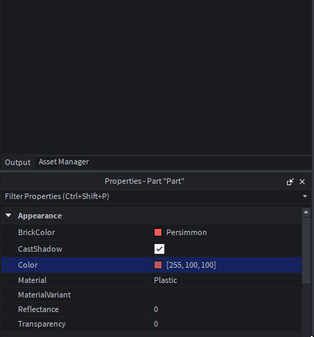
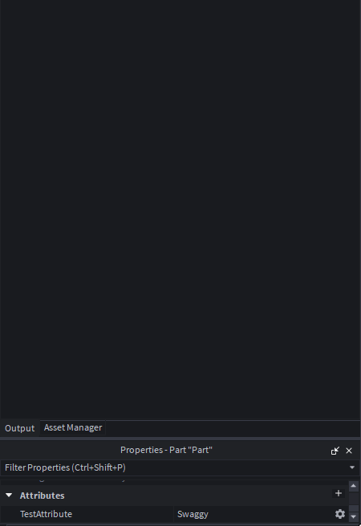

# Using all declarations

:::info

**Make sure to first read "Using states and connections"!** This will ensure you fully understand the content of this page, since information surrounding states and connection will be moved through quickly.

:::

Previously, you learned about using states and connections on a basic level to make some things react to others. However, this isn't the full potential of it, and you can use the states with declarations and more!

The most important declaration is `New`, which creates an instance.

Let's use it in an example to show you how it works. To begin, let's create a part in workspace, and then create a smiling face decal in that part:

```lua
local Seam = require(ReplicatedFirst.Seam)
local New = Seam.New

-- A 5x5x5 part, parented to workspace
local MyPart = New("Part", {
	Size = Vector3.new(5, 5, 5),
	Anchored = true,
	Position = Vector3.new(0, 5, 0),
	Parent = workspace,
	Color = Color3.fromRGB(255, 100, 100),
})

-- A smiley face decal, parented to the part
local MyDecal = New("Decal", {
	Texture = "rbxassetid://32012505",
	Face = "Front",
	Parent = MyPart
})
```



`New` takes two parameters. The first tells it what to create (as a string, existing instance, or component), and the second is a dictionary of properties and values for the properties. In the above example, we create a part with the respective properties, and a decal with the other respective properties.

:::info

**The first parameter matters.** Since it takes any of three types, we are just going to use a string, which just declares what instance type to make. If you put in an instance, it will "hydrate" that instance with your new properties, and if you put in a component, it will create an instance of that component. Read about hydration and components in the documentation!

:::

A way to simplify our above example is to use `Children`. Something to note is that property indexes of `New` can be another Seam declaration. So for example, instead of doing:

```lua
local X = New("Instance", {
    -- ...
})

local Y = New("Instance", {
    Parent = X,
    -- ...
})
```

We can do:

```lua
local X = New("Instance", {
    [Children] = {
        New("Instance", {
            -- ...
        }),

        -- ...
    },

    -- ...
})
```

So, let's do this for our first example:

```lua
local Seam = require(ReplicatedFirst.Seam)
local New = Seam.New
local Children = Seam.Children

-- A 5x5x5 part, parented to workspace
local MyPart = New("Part", {
	Size = Vector3.new(5, 5, 5),
	Anchored = true,
	Position = Vector3.new(0, 5, 0),
	Parent = workspace,
	Color = Color3.fromRGB(255, 100, 100),
	
	[Children] = {
		-- A smiley face decal, parented to the part
		New("Decal", {
			Texture = "rbxassetid://32012505",
			Face = "Front",
		})
	}
})
```

This produces the exact same result as before, so whether or not you use this is completely up to your preference.

:::info

**You can also use a state with `Children`!** Read more about this on `Children`'s documentation.

:::

Just like property indexes, and you can also set a property value to a Seam object. For example, we can animate the position of the part to float up and down using a spring state!

```lua
local Seam = require(ReplicatedFirst.Seam)
local New = Seam.New
local Children = Seam.Children
local Value = Seam.Value
local Spring = Seam.Spring

local PartPosition = Value(Vector3.new(0, 5, 0))
local AnimatedPartPosition = Spring(PartPosition, 2, 0.1)

local MyPart = New("Part", {
	Size = Vector3.new(5, 5, 5),
	Anchored = true,
	Position = AnimatedPartPosition, -- Now using AnimatedPartPosition for the position
	Parent = workspace,
	Color = Color3.fromRGB(255, 100, 100),
	
	[Children] = {
		New("Decal", {
			Texture = "rbxassetid://32012505",
			Face = "Front",
		})
	}
})

-- In a normal circumstance this is bad to do, but hey, it's just for example's sake
while true do
	task.wait(2)
	PartPosition.Value = Vector3.new(0, 6, 0)
	task.wait(2)
	PartPosition.Value = Vector3.new(0, 5, 0)
end
```


By setting `Position` to `AnimatedPartPosition` in this case, we are telling Seam to always update the position of the part to the value of `AnimatedPartPosition`!

Another declaration we can try is `FollowProperty`, which tracks a property of an Instance and sets a `Value` state to the value of that property when it changes.

Here is an example using this for the part's color (and printing the change):

```lua
local Seam = require(ReplicatedFirst.Seam)
local New = Seam.New
local Children = Seam.Children
local Value = Seam.Value
local OnChanged = Seam.OnChanged
local FollowProperty = Seam.FollowProperty

local CurrentColor = Value(Color3.fromRGB(0, 0, 0))

local MyPart = New("Part", {
	Size = Vector3.new(5, 5, 5),
	Anchored = true,
	Position = Vector3.new(0, 5, 0),
	Parent = workspace,
	Color = Color3.fromRGB(255, 100, 100),
	
	[FollowProperty "Color"] = CurrentColor, -- Now, CurrentColor will always be the part color

	[Children] = {
		New("Decal", {
			Texture = "rbxassetid://32012505",
			Face = "Front",
		})
	}
})

OnChanged(CurrentColor, function(PropertyChanged : string, NewValue : Color3)
	warn("The color changed! Here is the new color:")
	print(NewValue)
end)
```



Similar to this is `FollowAttribute`, which instead tracks an attribute in a similar way. In the below example, we use this and `Attribute`; `Attribute` sets an attribute to a value of your choice, including a state.

Here is an example using both:

```lua
local Seam = require(ReplicatedFirst.Seam)
local New = Seam.New
local Children = Seam.Children
local Value = Seam.Value
local OnChanged = Seam.OnChanged
local FollowAttribute = Seam.FollowAttribute
local Attribute = Seam.Attribute

local CurrentAttributeValue = Value("")

local MyPart = New("Part", {
	Size = Vector3.new(5, 5, 5),
	Anchored = true,
	Position = Vector3.new(0, 5, 0),
	Parent = workspace,
	Color = Color3.fromRGB(255, 100, 100),
	
	[Attribute "TestAttribute"] = "Swaggy", -- Make TestAttribute attribute start with the "Swaggy" value
	[FollowAttribute "TestAttribute"] = CurrentAttributeValue, -- Now, CurrentAttributeValue will always be the attribute value

	[Children] = {
		New("Decal", {
			Texture = "rbxassetid://32012505",
			Face = "Front",
		})
	}
})

OnChanged(CurrentAttributeValue, function(PropertyChanged : string, NewValue : string)
	warn("The attribute` changed! Here is the new value:")
	print(NewValue)
end)
```



The final declaration is `Lifetime`, which is super simple... this just tells Seam to despawn something after a defined number of seconds! This must take a number, in seconds.

In this example, we despawn the created part after 5 seconds:

```lua
local Seam = require(ReplicatedFirst.Seam)
local New = Seam.New
local Children = Seam.Children
local Lifetime = Seam.Lifetime

local MyPart = New("Part", {
	Size = Vector3.new(5, 5, 5),
	Anchored = true,
	Position = Vector3.new(0, 5, 0),
	Parent = workspace,
	Color = Color3.fromRGB(255, 100, 100),
	
	[Lifetime] = 5,
	
	[Children] = {
		New("Decal", {
			Texture = "rbxassetid://32012505",
			Face = "Front",
		})
	}
})
```


And that wraps up the complete set of information regarding declarations. Learn how to use `New` and `Component` in the "Making a component" tutorial!